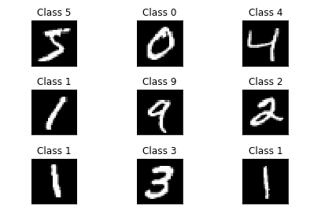
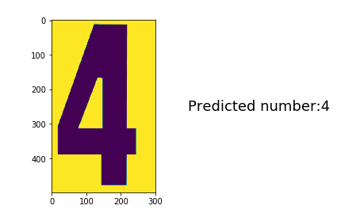
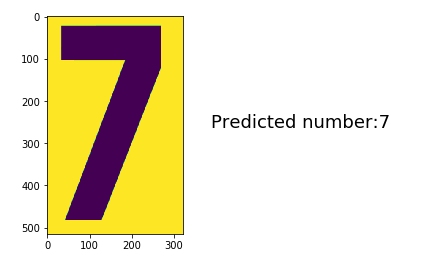

# Digit Recognition through static images
<p align="center">

</p>
Numbers are everywhere! Humans can read and recognize digits within few milliseconds. Let us teach computers to do the same through convolutional neural networks.   <br />


## Objective

This project aims to build a convolutional neural network that classifies images of digits from 0-9 . 

## Dataset description

The National Institute for Standards and Technology (NIST) has amassed a large database of digits which is freely available, and has become somewhat of a benchmark for testing classification algorithms. The MNIST database is a modified set compiled from several NIST databases. It consists of 60,000 training examples and 10,000 test samples, each of which is a 28 x 28 pixel greyscale image.

The Keras framework comes already with a MNIST Dataset that can be downloaded. It contains 60.000 images of handwritten images that can be used to train a neural network.

A glimpse into the dataset is provided below:


More information about the data set used in the study can be found at: 
http://yann.lecun.com/exdb/mnist/
## Tools required

- [Python](https://www.python.org/). Python 3 is the best option.
- [IPython and the Jupyter Notebook](http://ipython.org/). (FKA IPython and IPython Notebook.)
- Some scientific computing packages:
	- numpy
	- pandas
	- scikit-learn
	- matplotlib
- Deep learning packages
	- keras
	- tensorflow
	- theano
- Computer vision packages
	- OpenCV
  
## Installation of Python and packages

Install Python 3 and all of these packages in a few clicks with the [Anaconda Python distribution](https://www.continuum.io/downloads). 

Anaconda is very popular amongst Data Science and Machine Learning communities.

The packages used in this project are:

1. numpy
2. keras
3. opencv
4. tensorflow
5. matplotlib

Commands for installation of packages in Anaconda are:

1. conda install -c conda-forge keras 
2. conda install -c conda-forge tensorflow
3. conda install -c conda-forge opencv

## The Analytical Approach

### Data Loading

The MNIST dataset is available by default in the keras package.

Read the dataset MNIST
```{r load_data}
from keras.datasets import mnist
# the data, split between train and test sets
(x_train, y_train), (x_test, y_test) = mnist.load_data()
```



### Preparing the dataset

#### Steps:

* Reshape data

The image_data_format parameter affects how each of the backends treat the data dimensions when working with multi-dimensional convolution layers (such as Conv2D, Conv3D, Conv2DTranspose, Copping2D, … and any other 2D or 3D layer). Specifically, it defines where the 'channels' dimension is in the input data.

Both TensorFlow and Theano expects a four dimensional tensor as input. But where TensorFlow expects the 'channels' dimension as the last dimension (index 3, where the first is index 0) of the tensor – i.e. tensor with shape (samples, rows, cols, channels) – Theano will expect 'channels' at the second dimension (index 1) – i.e. tensor with shape (samples, channels, rows, cols). The outputs of the convolutional layers will also follow this pattern.

```{python impute function}
if K.image_data_format() == 'channels_first':
    x_train = x_train.reshape(x_train.shape[0], 1, img_rows, img_cols)
    x_test = x_test.reshape(x_test.shape[0], 1, img_rows, img_cols)
    input_shape = (1, img_rows, img_cols)
else:
    x_train = x_train.reshape(x_train.shape[0], img_rows, img_cols, 1)
    x_test = x_test.reshape(x_test.shape[0], img_rows, img_cols, 1)
    input_shape = (img_rows, img_cols, 1)
```

Mixing up the channels order would result in your models being trained in unexpected ways.

* Normalize data

```{python impute function}
x_train = x_train.astype('float32')
x_test = x_test.astype('float32')
x_train /= 255
x_test /= 255
```
* Convert number of classes to categorical

```{python impute function}
y_train = keras.utils.to_categorical(y_train, num_classes)
y_test = keras.utils.to_categorical(y_test, num_classes)
```
### Building the network

```{}
model = Sequential()
model.add(Conv2D(32, kernel_size=(3, 3),
                 activation='relu',
                 input_shape=input_shape))
model.add(Conv2D(64, (3, 3), activation='relu'))
model.add(MaxPooling2D(pool_size=(2, 2)))
model.add(Dropout(0.25))
model.add(Flatten())
model.add(Dense(128, activation='relu'))
model.add(Dropout(0.5))
model.add(Dense(num_classes, activation='softmax'))
```
 

#### Compiling and training the model

```{}
model.compile(loss=keras.losses.categorical_crossentropy,
              optimizer=keras.optimizers.Adadelta(),
              metrics=['accuracy'])

model.fit(x_train, y_train,
          batch_size=batch_size,
          epochs=epochs,
          verbose=1,
          validation_data=(x_test, y_test))
score = model.evaluate(x_test, y_test, verbose=0)
print('Test loss:', score[0])
print('Test accuracy:', score[1])
```


  

#### Plot of model training and model test

  
<p align="left">
  
</p>

#### Images of prediction

img src="prediction1.PNG" width="425"/>  
<p align="left">

</p>
##### Click [here](./MNIST_detect.ipynb) to go to the notebook where the entire case study steps has been performed.


