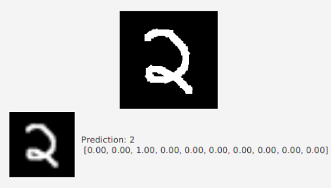
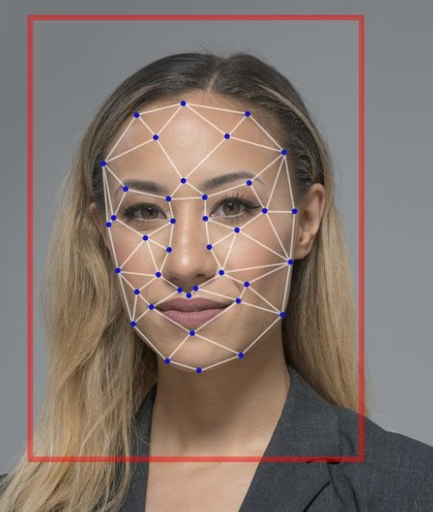

This repository aims at performing deep learning on a variety of image classsifcation tasks through programming in Python using packages Keras and OpenCV.

#### This repository contains the following projects:

### 1. [Digit Recognition](./Digit%20Recognition)

In this project, we will have a glimpse into how MNIST data can be used to recognize digits from 0-9 using convolutional neural networks using the MNIST dataset. We predict the digits using the trained algorithm through the following three methods: 

 1. Static images, 

 2. Live feed webcam 

 3. Hand movements. 
 

### 2. [Face Recognition](./Face_Recognition)

In this project, we will have a glimpse into how a database of people's faces can be used to recognize a person using convolutional neural networks. We recognize multiple faces using the trained algorithm through the following three methods:

 1. Static images, 

 2. Live feed webcam 

 3. Video feed. 
 

# Deep Learning

Deep learning is a machine learning technique that teaches computers to do what comes naturally to humans: learn by example. 
Deep learning models can achieve state-of-the-art accuracy, sometimes exceeding human-level performance. Models are trained by using a large set of labeled data and neural network architectures that contain many layers.

The term “deep” usually refers to the number of hidden layers in the neural network. Traditional neural networks only contain 2-3 hidden layers, while deep networks can have as many as 150.

# Convolutional Neural Networks

One of the most popular types of deep neural networks is known as convolutional neural networks (CNN or ConvNet). A CNN convolves learned features with input data, and uses 2D convolutional layers, making this architecture well suited to processing 2D data, such as images.

CNNs eliminate the need for manual feature extraction, so you do not need to identify features used to classify images. The CNN works by extracting features directly from images. The relevant features are not pretrained; they are learned while the network trains on a collection of images. This automated feature extraction makes deep learning models highly accurate for computer vision tasks such as object classification.

